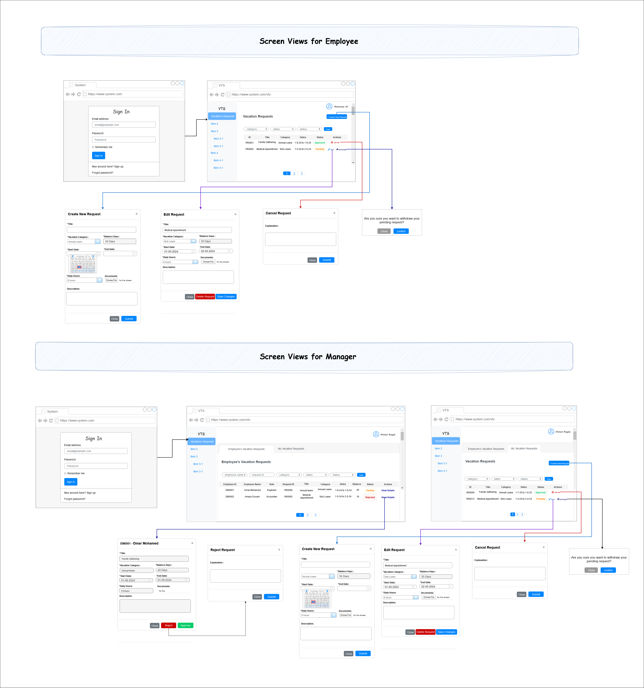

# Vacation Tracking System (VTS)

## Content List

1. [Vision](#vision)
2. [Most Important Goal](#goal)
3. [Requirements](#requirements)  
   3.1. [Functional Requirements](#functional-requirements)  
   3.2. [Non-Functional Requirements](#non-functional-requirements)  
   3.3. [Constraints](#constraints)  
4. [Domain (Define Problem)](#domain)
5. [Use Case Model for the System](#use-case-model-for-the-system)  
   5.1. [Actors](#actors)  
   5.2. [Use Cases](#use-cases)  
   5.3. [Use Case Diagram](#use-case-diagram)  
6. [Manage Time Use Case](#manage-time-use-case)  
   6.1. [Actors](#manage-time-use-case-actors)  
   6.2. [Manage Time Use Case Flows](#manage-time-use-case-flows)  
          6.2.1. [Main Flow: Create a New Vacation Request](#main-flow-create-a-new-vacation-request)  
          6.2.2. [Alternate Flow: Withdraw a Pending Vacation Request](#alternate-flow-withdraw-a-pending-vacation-request)  
          6.2.3. [Alternate Flow: Cancel an Approved Vacation Request](#alternate-flow-cancel-an-approved-vacation-request)  
          6.2.4. [Alternate Flow: Edit a Pending Vacation Request](#alternate-flow-edit-a-pending-vacation-request)  
   6.3. [Data Model](#data-model)  
   6.4. [Pseudocode](#pseudocode)  
   6.5. [UML Diagrams](#uml-diagrams)  
          6.5.1. [Sequence Diagram](#sequence-diagram)  
          6.5.2. [Activity Diagram](#activity-diagram)  
          6.5.3. [State Machine Diagram](#state-machine-diagram)  
   6.6. [UI Screens](#ui-screens) 
---

## Vision  

The vision of the Vacation Tracking System (VTS) is to provide individual employees with the capability to manage their own vacation time, sick leave, and personal time off without needing to be experts in company policy or local facility leave policies. 

--- 

## Most Important Goal  

- The primary goal is to empower employees to manage this aspect of their employment agreements, streamline HR functions, and minimize non-core activities for management. 
- The system aims to be easy to use, intuitive, and intelligent to ensure its success and acceptance by end users. 
    
--- 

## Requirements 

### `Functional Requirements`: 
- **Manage Time**:  
	Employees can request, view, and cancel vacation time requests. 
- **Approve Request**:  
	Managers can approve or deny subordinates' vacation time requests. 
- **Award Time**:  
	Managers can award extra leave time (comp time) to subordinates. 
 - **Edit Employee Record**:  
	HR clerks can edit employee information, including leave time allowances and maximum time that can be awarded by managers. 
- **Manage Locations**:  
	HR clerks can manage location records and their associated rules. 
- **Manage Leave Categories**:  
	HR clerks can manage leave categories and their associated rules. 
- **Override Leave Records**:  
	HR clerks can override any rejection of leave time requests made by the system's rules. 
- **Back-Up System Logs**:  
	System administrators can back up the system’s logs. 
- **Email Notifications**:  
	The system sends email notifications for manager approvals and status changes of requests. 
- **Activity Logging**:  
        The system logs all transactions and overrides. 
- **Web Service Interface**:  
	The system provides a web service interface for querying employee vacation request summaries. 
- **HR System Integration**:  
	The system interfaces with HR legacy systems to retrieve and update employee information. 


### `Non-Functional Requirements`: 
- **Ease of Use**:  
	The system must be easy to use, intuitive, and intelligent to ensure user acceptance and successful implementation. 
- **Performance**:  
	The system should streamline the vacation request process, reducing the time taken for approvals and minimizing manual interventions. 
- **Scalability**: 
 	The system should be able to handle requests for the previous calendar year and up to a year and a half in the future. 
- **Security**:  
	The system must use the existing intranet portal’s single-sign-on mechanisms for authentication and ensure secure access to employee data. 
- **Reliability**: 
	 The system should keep activity logs for all transactions and provide mechanisms for HR and system administration personnel to override actions with proper 	         logging. 
- **Maintainability**:  
	The system should be designed to allow easy updates and management of rules by HR personnel.
- **Integration**: 
	The system must integrate with existing hardware, middleware, and HR department legacy systems. 
- **Email Notifications**:  
	The system should use email notifications to inform managers and employees about the status of vacation requests. 
- **Logging**:  
	The system should maintain detailed logs of all transactions and overrides for auditing and troubleshooting purposes. 

### `Constraints`:  
- **Ease of Use**: 
The system must be easy to use, intuitive, and intelligent to ensure it is accepted by end users. 
- **Existing Hardware and Middleware**:  
	The system must use existing hardware and middleware. 
- **Intranet Portal Integration**:  
	The VTS must be implemented as an extension to the existing intranet portal system and use the portal’s single-sign-on mechanisms for all authentication. 
- **Browser Compatibility**:  
	The application should behave properly on all standard HTML 3.2–capable browsers, ensuring no dependencies on specific browser versions or features. 
- **Client State Management**:  
	The system must manage client state effectively in a connectionless environment, using mechanisms like cookies or URL redirection. 
- **Security**:  
	The system must ensure secure access, particularly through the use of the Central Authentication Service (CAS) for single-sign-on. 
- **Performance and Scalability**:  
	The system should be designed to handle performance and scalability requirements, including the potential use of a Web server farm and intelligent routing for load balancing. 
- **Rules-Based Validation**:  
	The system must implement a flexible rules-based system for validating and verifying leave time requests. 
- **Manager Approval**:  
	The system should enable optional manager approval for vacation requests. 
- **Email Notifications**:  
	The system must use email notifications to request manager approval and notify employees of request status changes. 
- **Activity Logs**: 
 	The system must keep activity logs for all transactions. 
- **HR and System Administration Overrides**:  
	The system must allow HR and system administration personnel to override actions restricted by rules, with logging of those overrides. 
- **Web Service Interface**:  
	The system must provide a Web service interface for other internal systems to query any given employee’s vacation request summary. 
- **Legacy System Integration**:  
	The system must interface with HR department legacy systems to retrieve required employee information and changes. 

--- 

## Domain (Define Problem): 

The Vacation Tracking System (VTS) focuses on managing employee leave within a business organization. It addresses challenges managers face in tracking vacation time, sick leave, and personal time off, especially in workplaces with decentralized teams and multiple reporting managers. 

### `Key Issues`: 
- **Decentralized Work Environment**: 
	Employees work on different projects and report to various managers, making it hard to coordinate vacation schedules. 
- **Manual Processes**: 
	Traditional leave management relies on manual approvals, causing delays and inefficiencies. 
- **Lack of Awareness**: 
	Limited manager-employee interactions make it hard for managers to stay updated on vacation plans. 
- **HR Burden**: 
	The HR team spends unnecessary time handling vacation requests, diverting focus from core activities. 
- **Employee Empowerment**: 
	Employees need a simple system to manage their leave without worrying about complex policies. 

### `VTS Solutions`: 
- Enables employees to manage vacation time, sick leave, and personal time off easily. 
- Automates approval processes with rules-based validation, reducing HR involvement. 
- Provides managers with efficient tools for reviewing and approving requests. 
- Integrates seamlessly with company systems, offering single-sign-on via the intranet.

---

## Use Case Model for the System 

### `Actors of the System` 
- **Employee**: 
	- Main user managing vacation requests. 
	- Includes actions like submitting, viewing, and canceling requests. 
- **Manager**: 
	- Reviews and approves subordinate requests. 
	- Awards compensatory leave within defined limits. 
 - **HR Clerk**: 
	- Updates employee records and manages rules for leave policies and locations. 
	- Overrides system restrictions for leave requests when necessary. 
 - **System Admin**: 
	- Ensures system stability and functionality. 
	- Maintains logs and performs backups. 
 
### `Main use cases` 
- **Manage Time**: 
	- Employees can create, view, or cancel their vacation time requests. 
 - **Approve Request**: 
	- Managers review leave requests submitted by their subordinates. 
	- Approvals can be completed through the system interface. 
 - **Award Time**: 
	- Managers grant additional personal leave time to employees. 
 - **Edit Employee Record**: 
	- HR clerks manage employee data, including leave time balances and maximum awardable limits. 
 - **Manage Locations**: 
	- HR clerks define and modify location-specific policies, such as holidays or work-specific rules. 
 - **Manage Leave Categories**: 
	- HR clerks oversee the creation and modification of leave categories (e.g., sick leave, vacation). 
 - **Override Leave Records**: 
	- HR clerks manually approve or reject leave requests, made by the rules in the system. 
 - **Back Up System Logs**: 
	- System administrators back up the system’s logs. 

### `Use Case Diagram` 

A visual representation of use cases and actors

 

--- 

## Manage Time Use Case 

### `Actors`  
- Employee
- Manager 

### Manage Time Use Case Flows
  
### `Main Flow : Create a New Vacation Request` 

#### **Goal** : 
An Employee intends to submit a new vacation request. 

#### **Precondition** : 
- **Authentication Completed**: 
	- The employee is authenticated through the portal framework. 
- **Employee Identified**: 
	- The employee is identified as a company employee with the privilege to manage their vacation requests. 

#### **Flow Steps** : 
 1. The employee clicks a link on the intranet portal to access the Vacation Tracking System (VTS). 
 2. The VTS verifies the employee's credentials and displays vacation request statuses and balances for the past 6 months and up to 18 months ahead. 
 3. To create a new request, the employee selects a vacation category with available balance. 
 4. The VTS prompts the employee to choose dates and times using a visual calendar. 
 5. The employee selects dates, specifies hours (e.g., 4 hours for a half-day), and adds a title and description for manager review before submitting the request. 
 6. If there are errors, the form highlights them, allowing the employee to correct or cancel the request. 
 7. Once correct, the request is submitted, and the employee returns to the main VTS page. If approval is required, the manager receives an email notification. 
 8. The request is marked as "pending approval." 
 9. The manager clicks the email link or logs into the portal to access the VTS. 
 10. The manager may need to log in to access the system. 
 11. On the VTS homepage, the manager views their own vacation details and pending employee requests. 
 12. The manager reviews requests one by one, choosing to approve or deny each. Denied requests require an explanation. 
 13. The system updates the request status to "approved" or "rejected." 
 14. The employee receives an email notification about the decision. 
 15. The manager returns to the VTS homepage to handle other tasks or log out. 

#### **Flowchart**: 
 

#### **Postcondition**: 
- **Request Status Updated**: 
	- The vacation request is either in an "approved," "rejected," or "pending approval" state, depending on the actions taken by the employee and manager. 
- **Notification Sent**: 
	- If manager approval is required, the manager is notified of the pending request via email. 
	- The employee is notified via email about the outcome of the request (approved or rejected). 
- **System Updated**: 
	- The vacation balances and request history for the employee are updated in the VTS. 
	- The manager's list of pending approvals is updated, removing processed requests. 
- **Employee Returned to Main Page**: 
	- The employee is redirected to the VTS home page after submitting the request or fixing errors. 
- **Manager Workflow Concluded**: 
	- The manager completes the review of the vacation request and is returned to the main VTS page for further actions or logout.
 
### `Alternate Flow: Withdraw a Pending Vacation Request` 

#### **Goal** :  
The Employee wishes to withdraw a pending vacation request. 
  
#### **Precondition** : 
- **Authentication Completed**: 
	- The employee is authenticated through the portal framework. 
- **Employee Identified**: 
	- The employee is identified as a company employee with the privilege to manage their vacation requests. 
- **Vacation Request Pending**: 
	- The employee has made a vacation request, and it is still awaiting approval. 

#### **Flow Steps** : 
 1. The employee clicks a link on the intranet portal to access the Vacation Tracking System (VTS). 
 2. The VTS verifies the employee's credentials and displays vacation request statuses and balances for the past 6 months and up to 18 months ahead. 
 3. The employee selects a pending vacation request they want to withdraw. 
 4. The VTS asks the employee to confirm the withdrawal of the vacation request. 
 5. The employee confirms, and the request is removed from the manager’s list of pending approvals. 
 6. The system sends a notification email to the manager. 
 7. The system updates the request status to "withdrawn."

#### **Flowchart**: 
 

#### **Postcondition** : 
 - Request Status Updated: 
	- The vacation request status is updated to "withdrawn" in the system, and it is removed from the manager’s list of pending approvals. 
 - Notification Sent: 
	- The manager is notified via email about the withdrawal of the vacation request. 

### `Alternate Flow: Cancel an Approved Vacation Request` 

#### **Goal** : 
The Employee wishes to cancel an approved vacation request. 
 
#### **Precondition** : 
 - **Authentication Completed**: 
	- The employee is authenticated through the portal framework. 
 - **Employee Identified**: 
	- The employee is identified as a company employee with the privilege to manage their vacation requests. 
 - **Vacation Request Approved**: 
	- The employee has made a vacation request, which has been approved and scheduled for a future date or within the recent past ( 5 business days). 

#### **Flow Steps** : 
 1. The employee clicks a link on the intranet portal to access the Vacation Tracking System (VTS). 
 2. The VTS verifies the employee's credentials and displays vacation request statuses and balances for the past 6 months and up to 18 months ahead. 
 3. The employee selects an approved vacation request to cancel, either for a future date or recent past. 
	- For future requests, the employee confirms the cancellation. 
	- For recent past requests, the employee confirms and provides a brief explanation. 
 4. Once confirmed, the system sends an email to the manager, marks the request as canceled, and restores the used vacation time to the employee. 
 5. The employee can cancel the process at any time without making changes. 
 6. The employee returns to the VTS home page, where updates are reflected in the summaries. 

#### **Flowchart** : 
 

#### **Postcondition** : 
 - **Request Status Updated**: 
	- The vacation request status is updated to "canceled" in the system. 
 - **Vacation Time Restored**: 
	- The time allowances used for the canceled request are returned to the employee's available balance. 
 - **Notification Sent**: 
	- An email notification is sent to the manager informing them of the cancellation. 
 - **System Updated**: 
	- The VTS home page reflects the changes in the vacation request summaries and balances.  

### `Alternate Flow: Edit a Pending Vacation Request` 

#### **Goal** : 
	The employee wants to update the details of a pending vacation request. 

#### **Precondition** : 
 - **Authentication Completed**: 
	- The employee is authenticated through the portal framework. 
 - **Employee Identified**: 
	- The employee is identified as a company employee with the privilege to manage their vacation requests. 
 - **Vacation Request Pending**: 
	- The employee has made a vacation request, and it is still awaiting approval. 

#### **Flow Steps** : 
 1. The employee opens the VTS home page through the intranet portal, where they are authenticated and granted access. 
 2. The VTS home page shows a summary of vacation requests, balances, and the status of requests from the past 6 months and up to 18 months in the future. 
 3. The employee selects a pending vacation request to edit. 
 4. The VTS shows an editable form where the employee can update the title, comments, or dates. The employee can also choose to withdraw or delete the request. 
 5. The employee updates the details and submits the changes. 
 6. If the employee decides to withdraw the request, the VTS asks for confirmation before completing the withdrawal. 
 7. If only changes are made, they are saved, and the employee is returned to the VTS home page. 
 8. If there are errors in the updates, the VTS highlights the issues and displays the editing form again for corrections. 

#### **Flowchart** : 
 

#### **Postcondition** : 
 - **Request Status Updated**: 
	- If changes are made, the vacation request is updated in the system with the new details. 
	- If the request is withdrawn, its status is updated to "withdrawn." 
 - **Notification Sent**: 
	- If the request is withdrawn, the manager is notified via email about the withdrawal. 
 - **System Updated**: 
	- The VTS home page reflects the updated information, including the revised request or its removal if withdrawn. 
	- If the request is withdrawn, the vacation time allowances are restored to the employee's available balance . 


### Entities (Data Model)  
1. **Location**: 
	- locationId , name 
2. **Employee**: 
	- employeeId , name , email , roleId , joinDate , balanceDays , status , locationId 
3. **Role**: 
	- roleId , roleName , permissions 
4. **Category**: 
	- categoryId , categoryName , Description , grantId 
5. **VacationRequest**: 
	- requestId , employeeId , categoryId , requestDate , hoursPerDate , status , requestTitle , requestDescription 
6. **Grant**: 
	- grantId , categoryId , grantAmount , grantPeriod 
7. **Restriction**: 
	- restrictionId , categoryId , restrictionType , restrictionValue , description 

### `Pseudocode` 

```plaintext 

Start 
    Employee Input Username and Password 
    IF (isAuthenticated?)  
        THEN "Redirect to VTS HomePage" 
        THEN DISPLAY "Vacation Requests List" 
    ELSE  
        DISPLAY "Error Message" 
    END IF 
    IF (Employee Click Create New Request) 
        THEN DISPLAY New Request Form 
        THEN Employee INPUT Date, Time, Title, Description 
        IF (Validation Passed?) 
            THEN Employee SUBMIT Request 
        ELSE  
            DISPLAY "Error Message" 
        END IF 
        IF (Require Manager Approval?) 
            THEN SEND Email to Manager 
            THEN Manager Reviews Request 
            IF (Manager Doesn't Approve Request?) 
                Employee ENTER Explanation  
                THEN Employee SUBMIT Result 
            END IF 
            UPDATE Request Status 
            THEN SEND Email to Employee 
        ELSE 
            APPROVE Request Automatically 
    ELSE IF (Employee Click Edit for Selected Pending Request) 
        THEN OPEN Editable View 
        THEN Employee EDIT Title or Description or Dates 
        THEN Employee SUBMIT Changes 
        IF (Validation Passed?) 
            THEN UPDATE Request Data 
        ELSE  
            DISPLAY "Error Message" 
        END IF 
    ELSE IF (Employee Click WITHDRAW for Selected Pending Request) 
        THEN SEND "Email to Manager" 
        THEN Update Request Status 
    ELSE IF (Employee Click CANCEL for Selected Approved Request) 
        IF (Not Future Request?) 
            Employee WRITE Explanation 
        END IF  
        Employee CONFIRM Request 
        SEND "Email to Manager" 
        Update Request Status 
    END IF 
END 

``` 

### UML Diagrams 

### `Sequence Diagram `: 
 

### `Activity Diagram` : 
 

### `State Machine Diagram` : 
 

### `UI Screens` 
 

 
