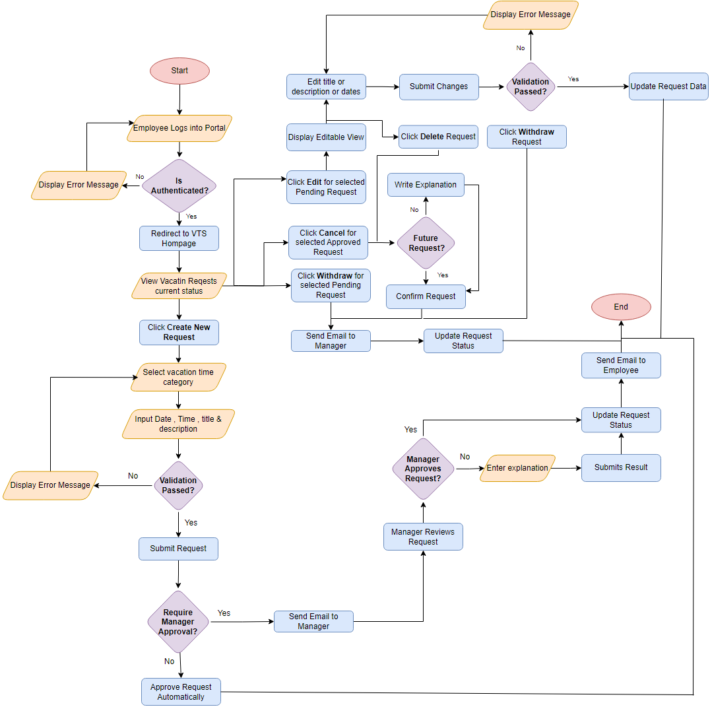

# Vacation Tracking System (VTS) Task 

## Table of Contents
- [Vision](#vision)
- [Function](#function)
- [Non-Function](#non-function)
- [Constraints](#constraints)
- [Domain (Define Problem)](#domain-define-problem)
- [Actors of the System](#actors-of-the-system)
- [Manage Time Use Case](#manage-time-use-case)
- [Entities (Data Model)](#entities-data-model)
- [Flowchart [Flow]](#flowchart-flow)
- [Pseudocode](#pseudocode)
- [Sequence Diagram](#sequence-diagram)

---

## Vision

The vision of the Vacation Tracking System (VTS) is to provide individual employees with the capability to manage their own vacation time, sick leave, and personal time off without needing to be experts in company policy or local facility leave policies.

The primary goal is to empower employees to manage this aspect of their employment agreements, streamline HR functions, and minimize non-core activities for management.

The system aims to be easy to use, intuitive, and intelligent to ensure its success and acceptance by end users.

---

## Function: Functional Requirements

The key functions derived from the requirements of the Vacation Tracking System (VTS) are:
1. **Manage Time**: Employees can request, view, and cancel vacation time requests.
2. **Approve Request**: Managers can approve or deny subordinates' vacation time requests.
3. **Award Time**: Managers can award extra leave time (comp time) to subordinates.
4. **Edit Employee Record**: HR clerks can edit employee information, including leave time allowances and maximum time that can be awarded by managers.
5. **Manage Locations**: HR clerks can manage location records and their associated rules.
6. **Manage Leave Categories**: HR clerks can manage leave categories and their associated rules.
7. **Override Leave Records**: HR clerks can override any rejection of leave time requests made by the system's rules.
8. **Back Up System Logs**: System administrators can back up the system’s logs.
9. **Email Notifications**: The system sends email notifications for manager approvals and status changes of requests.
10. **Activity Logging**: The system logs all transactions and overrides.
11. **Web Service Interface**: The system provides a web service interface for querying employee vacation request summaries.
12. **HR System Integration**: The system interfaces with HR legacy systems to retrieve and update employee information.

---

## Non-Function: Non-Functional Requirements

- **Ease of Use**: The system must be easy to use, intuitive, and intelligent to ensure user acceptance and successful implementation.
- **Performance**: The system should streamline the vacation request process, reducing the time taken for approvals and minimizing manual interventions.
- **Scalability**: The system should be able to handle requests for the previous calendar year and up to a year and a half in the future.
- **Security**: The system must use the existing intranet portal’s single-sign-on mechanisms for authentication and ensure secure access to employee data.
- **Reliability**: The system should keep activity logs for all transactions and provide mechanisms for HR and system administration personnel to override actions with proper logging.
- **Integration**: The system must integrate with existing hardware, middleware, and HR department legacy systems.
- **Maintainability**: The system should be designed to allow easy updates and management of rules by HR personnel.
- **Email Notifications**: The system should use email notifications to inform managers and employees about the status of vacation requests.
- **Logging**: The system should maintain detailed logs of all transactions and overrides for auditing and troubleshooting purposes.

---

## Constraints

- **Ease of Use**: The system must be easy to use, intuitive, and intelligent to ensure it is accepted by end users.
- **Existing Hardware and Middleware**: The system must use existing hardware and middleware.
- **Intranet Portal Integration**: The VTS must be implemented as an extension to the existing intranet portal system and use the portal’s single-sign-on mechanisms for all authentication.
- **Browser Compatibility**: The application should behave properly on all standard HTML 3.2–capable browsers, ensuring no dependencies on specific browser versions or features.
- **Client State Management**: The system must manage client state effectively in a connectionless environment, using mechanisms like cookies or URL redirection.
- **Security**: The system must ensure secure access, particularly through the use of the Central Authentication Service (CAS) for single-sign-on.
- **Performance and Scalability**: The system should be designed to handle performance and scalability requirements, including the potential use of a Web server farm and intelligent routing for load balancing.
- **Rules-Based Validation**: The system must implement a flexible rules-based system for validating and verifying leave time requests.
- **Manager Approval**: The system should enable optional manager approval for vacation requests.
- **Email Notifications**: The system must use email notifications to request manager approval and notify employees of request status changes.
- **Activity Logs**: The system must keep activity logs for all transactions.
- **HR and System Administration Overrides**: The system must allow HR and system administration personnel to override actions restricted by rules, with logging of those overrides.
- **Web Service Interface**: The system must provide a Web service interface for other internal systems to query any given employee’s vacation request summary.
- **Legacy System Integration**: The system must interface with HR department legacy systems to retrieve required employee information and changes.

---

## Domain (Define Problem)

The domain for the Vacation Tracking System (VTS) is employee leave management within a business organization. The problem it aims to solve includes:

- Decentralized work environments making it hard for managers to track employee vacations.
- Manual processes that are time-consuming and prone to delays.
- A lack of awareness about employee vacation plans among managers.
- Burden on HR departments for non-core activities.
- The need for a system that empowers employees to manage their own leave.

---

## Actors of the System

1. Employee  
2. Manager  
3. Clerk (HR department member)  
4. System Admin  

---

## Manage Time Use Case

**Manage Time Use Case**

---

## Entities (Data Model)

### 1. Location
- `locationId`
- `name`

### 2. Employee
- `employeeId`
- `name`
- `email`
- `roleId`
- `joinDate`
- `balanceDays`
- `status`

### 3. Role
- `roleId`
- `roleName`
- `permissions`

### 4. Category
- `categoryId`
- `categoryName`
- `description`
- `grantId`

### 5. VacationRequest
- `requestId`
- `employeeId`
- `categoryId`
- `requestDate`
- `hoursPerDate`
- `status`
- `requestTitle`
- `requestDescription`

### 6. Grant
- `grantId`
- `categoryId`
- `grantAmount`
- `grantPeriod`

### 7. Restriction
- `restrictionId`
- `categoryId`
- `restrictionType`
- `restrictionValue`
- `description`

---

## Flowchart [Flow]


---

## Pseudocode

```plaintext
Start
    Employee Input Username and Password
    IF (isAuthenticated?) 
        THEN "Redirect to VTS HomePage"
        THEN DISPLAY "Vacation Requests List"
    ELSE 
        DISPLAY "Error Message"
    END IF
    
    IF (Employee Click Create New Request)
        THEN DISPLAY New Request Form
        THEN Employee INPUT Date, Time, Title, Description
        IF (Validation Passed?)
            THEN Employee SUBMIT Request
        ELSE 
            DISPLAY "Error Message"
        END IF
        IF (Require Manager Approval?)
            THEN SEND Email to Manager
            THEN Manager Reviews Request
            IF (Manager Doesn't Approve Request?)
                Employee ENTER Explanation 
                THEN Employee SUBMIT Result
            END IF
            UPDATE Request Status
            THEN SEND Email to Employee
        ELSE
            APPROVE Request Automatically
    ELSE IF (Employee Click Edit for Selected Pending Request)
        THEN OPEN Editable View
        THEN Employee EDIT Title or Description or Dates
        THEN Employee SUBMIT Changes
        IF (Validation Passed?)
            THEN UPDATE Request Data
        ELSE 
            DISPLAY "Error Message"
        END IF
    ELSE IF (Employee Click WITHDRAW for Selected Pending Request)
        THEN SEND "Email to Manager"
        THEN Update Request Status
    ELSE IF (Employee Click CANCEL for Selected Approved Request)
        IF (Not Future Request?)
            Employee WRITE Explanation
        END IF 
        Employee CONFIRM Request
        SEND "Email to Manager"
        Update Request Status
    END IF
END

---

## Sequence Diagram

*(sequence diagram)*
